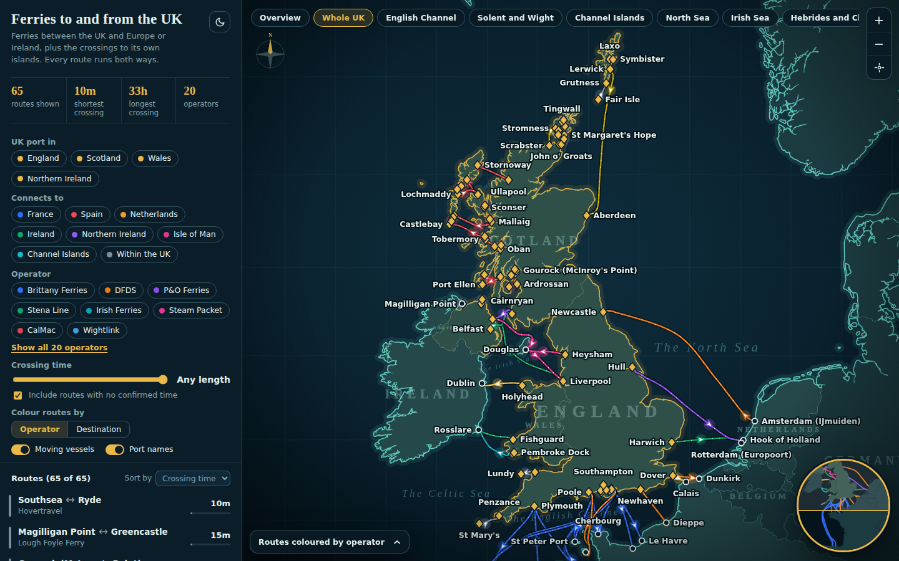

# Ferries to and from the UK

An interactive map of passenger ferry routes between the UK and Europe or Ireland, plus the crossings to UK islands. Pan and zoom the map, filter by destination, operator or crossing time, and click any route for its duration, operator, season and notes.



The whole site is one static file, `docs/index.html`. There is no server, no API and no tracking. The coastline is drawn from Natural Earth data that is baked into the page at build time.

## What it does

- 65 routes and 96 ports, coloured by operator or by destination
- Filters for UK nation, destination, operator and maximum crossing time
- Jump buttons for the Channel, Solent, Irish Sea, Hebrides, Orkney and Shetland and more
- Light and dark themes
- Shareable links: `#route=holyhead-dublin` opens a route and `#port=portsmouth` opens a port
- Animated vessels that shuttle along each route. They show direction only and are **not live ship positions**

## Publish it on GitHub Pages

1. Push this repo to GitHub.
2. Go to **Settings, Pages**.
3. Under **Build and deployment**, choose **Deploy from a branch**, then pick your main branch and the `/docs` folder.
4. Save. The site appears at `https://<your-username>.github.io/<repo-name>/` after a minute or so.

`docs/index.html` is committed already, so this works without running anything.

## Run it locally

You only need Node 18 or newer to rebuild. To just look at the site, open `docs/index.html` in a browser.

```sh
npm install
npm run build     # writes docs/index.html
npm run check     # validates the data without writing anything
```

The first build downloads the Natural Earth coastline (about 13 MB) into `.cache/`, which is git-ignored.

## How it is put together

```
src/template.html    the page: HTML, CSS and JavaScript
data/ports.json      every port, with coordinates
data/routes.json     every route, with operators, times and notes
data/regions.json    the zoom targets in the jump buttons
data/zones.json      country and sea names drawn on the map
scripts/build.js     projects the map, checks the data, writes docs/index.html
docs/index.html      the built site
```

`scripts/build.js` projects the coastline into a fixed canvas, simplifies it, draws each route as a smooth curve through its waypoints, and injects the result into the template.

## Editing the data

Add or change a port in `data/ports.json`:

```json
{"id":"holyhead","name":"Holyhead","country":"Wales","lon":-4.62,"lat":53.31,"rank":1,"side":"l"}
```

- `country` decides whether the port is drawn as a UK diamond or a circle. England, Scotland, Wales and Northern Ireland count as UK.
- `rank` sets label priority (1 is most important). `side` is the preferred label side: `l`, `r`, `t` or `b`.
- `isle` is optional and is shown in place of the country in the detail card, for example `"Skye"`.
- Small terminals that sit up to 5 km off the coast are snapped onto it automatically.

Add or change a route in `data/routes.json`:

```json
{"id":"holyhead-dublin","from":"holyhead","to":"dublin","nation":"Wales",
 "ops":["Irish Ferries","Stena Line"],"dest":"Ireland","min":200,
 "dur":"About 3h15 to 3h30","season":"Year-round","notes":"...",
 "via":[[-4.70,53.36],[-5.4,53.36]]}
```

- `from` is the UK port and `to` is the other end. Every route is treated as running both ways.
- `nation` is the UK nation of the `from` port, used by the "UK port in" filter.
- `dest` is the destination group used by the "Connects to" filter. Use `Within the UK` for island and estuary crossings.
- `min` is the typical crossing time in minutes, used for sorting and the slider. Use `null` when it is unknown, and put `Check timetable` in `dur`.
- `via` is a list of `[lon, lat]` waypoints that keep the drawn track over water.

Then run `npm run check`. It fails if a route crosses land, and it prints the coordinates so you know where to add a waypoint. The GitHub Action in `.github/workflows/check.yml` runs the same check on pull requests.

To add an operator colour, edit `OP_COLORS` in `src/template.html`. Operators without one share a grey colour and are listed as "Other island operators".

## Scope and accuracy

The map covers passenger ferries between the UK and another country, and the main crossings to UK islands. There are no regular passenger ferries between the UK and anywhere outside Europe.

Left out on purpose: freight-only routes, river hops under about 3 km, most small inter-island links, and Crown Dependency links that skip the UK.

Crossing times, seasons and operators were checked against operator and timetable sites in September 2026. Times for smaller island routes are approximate. Timetables change often, so treat this as a planning aid and confirm with the operator before you travel. Route lines are hand-drawn tracks, so distances are approximate.

## Credits

- Coastlines: [Natural Earth](https://www.naturalearthdata.com/), public domain
- Projection: [d3-geo](https://github.com/d3/d3-geo)
- Fonts: [Cinzel](https://fonts.google.com/specimen/Cinzel) and [Instrument Sans](https://fonts.google.com/specimen/Instrument+Sans), loaded from Google Fonts under the SIL Open Font Licence. The page falls back to system fonts if they cannot load.

## Licence

MIT, see `LICENSE`. Add your name to the copyright line.
